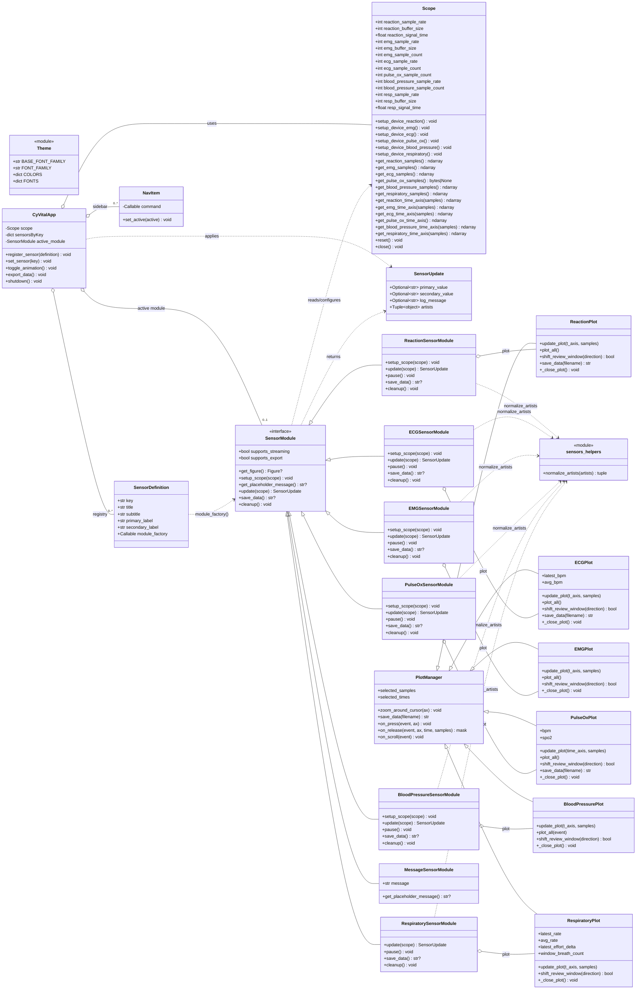

```mermaid
classDiagram
direction LR

%% =========================
%% Core acquisition / hardware
%% =========================
class Scope {
  +int reaction_sample_rate
  +int reaction_buffer_size
  +float reaction_signal_time
  +int emg_sample_rate
  +int emg_buffer_size
  +int emg_sample_count
  +int ecg_sample_rate
  +int ecg_sample_count
  +int pulse_ox_sample_count
  +int blood_pressure_sample_rate
  +int blood_pressure_sample_count
  +int resp_sample_rate
  +int resp_buffer_size
  +float resp_signal_time

  +setup_device_reaction() void
  +setup_device_emg() void
  +setup_device_ecg() void
  +setup_device_pulse_ox() void
  +setup_device_blood_pressure() void
  +setup_device_respiratory() void

  +get_reaction_samples() ndarray
  +get_emg_samples() ndarray
  +get_ecg_samples() ndarray
  +get_pulse_ox_samples() bytes|None
  +get_blood_pressure_samples() ndarray
  +get_respiratory_samples() ndarray

  +get_reaction_time_axis(samples) ndarray
  +get_emg_time_axis(samples) ndarray
  +get_ecg_time_axis(samples) ndarray
  +get_pulse_ox_time_axis() ndarray
  +get_blood_pressure_time_axis(samples) ndarray
  +get_respiratory_time_axis(samples) ndarray

  +reset() void
  +close() void
}

%% =========================
%% GUI models + theme
%% =========================
class SensorUpdate {
  +Optional~str~ primary_value
  +Optional~str~ secondary_value
  +Optional~str~ log_message
  +Tuple~object~ artists
}

class SensorDefinition {
  +str key
  +str title
  +str subtitle
  +str primary_label
  +str secondary_label
  +Callable module_factory
}

class Theme {
  <<module>>
  +str BASE_FONT_FAMILY
  +str FONT_FAMILY
  +dict COLORS
  +dict FONTS
}

%% =========================
%% GUI app & navigation
%% =========================
class NavItem {
  -Callable command
  +set_active(active) void
}

class CyVitalApp {
  -Scope scope
  -dict sensorsByKey
  -SensorModule active_module
  +register_sensor(definition) void
  +set_sensor(key) void
  +toggle_animation() void
  +export_data() void
  +shutdown() void
}

CyVitalApp o-- Scope : uses
CyVitalApp o-- "0..*" NavItem : sidebar
CyVitalApp o-- "0..*" SensorDefinition : registry
CyVitalApp o-- "0..1" SensorModule : active module
CyVitalApp ..> SensorUpdate : applies

SensorDefinition ..> SensorModule : module_factory()

%% =========================
%% Sensor module interface
%% =========================
class SensorModule {
  <<interface>>
  +bool supports_streaming
  +bool supports_export
  +get_figure() Figure?
  +setup_scope(scope) void
  +get_placeholder_message() str?
  +update(scope) SensorUpdate
  +save_data() str?
  +cleanup() void
}

SensorModule ..> Scope : reads/configures
SensorModule ..> SensorUpdate : returns

%% =========================
%% Concrete sensor modules
%% =========================
class ReactionSensorModule {
  +setup_scope(scope) void
  +update(scope) SensorUpdate
  +pause() void
  +save_data() str?
  +cleanup() void
}
class ECGSensorModule {
  +setup_scope(scope) void
  +update(scope) SensorUpdate
  +pause() void
  +save_data() str?
  +cleanup() void
}
class EMGSensorModule {
  +setup_scope(scope) void
  +update(scope) SensorUpdate
  +pause() void
  +save_data() str?
  +cleanup() void
}
class PulseOxSensorModule {
  +setup_scope(scope) void
  +update(scope) SensorUpdate
  +pause() void
  +save_data() str?
  +cleanup() void
}
class BloodPressureSensorModule {
  +setup_scope(scope) void
  +update(scope) SensorUpdate
  +pause() void
  +save_data() str?
  +cleanup() void
}
class RespiratorySensorModule {
  +update(scope) SensorUpdate
  +pause() void
  +save_data() str?
  +cleanup() void
}
class MessageSensorModule {
  +str message
  +get_placeholder_message() str?
}

SensorModule <|-- ReactionSensorModule
SensorModule <|-- ECGSensorModule
SensorModule <|-- EMGSensorModule
SensorModule <|-- PulseOxSensorModule
SensorModule <|-- BloodPressureSensorModule
SensorModule <|-- RespiratorySensorModule
SensorModule <|-- MessageSensorModule

%% =========================
%% Plot base class
%% =========================
class PlotManager {
  +selected_samples
  +selected_times
  +zoom_around_cursor(ax) void
  +save_data(filename) str
  +on_press(event, ax) void
  +on_release(event, ax, time, samples) mask
  +on_scroll(event) void
}

%% =========================
%% Concrete plot classes
%% =========================
class ReactionPlot {
  +update_plot(t_axis, samples)
  +plot_all()
  +shift_review_window(direction) bool
  +save_data(filename) str
  +_close_plot() void
}
class ECGPlot {
  +latest_bpm
  +avg_bpm
  +update_plot(t_axis, samples)
  +plot_all()
  +shift_review_window(direction) bool
  +save_data(filename) str
  +_close_plot() void
}
class EMGPlot {
  +update_plot(t_axis, samples)
  +plot_all()
  +shift_review_window(direction) bool
  +_close_plot() void
}
class PulseOxPlot {
  +bpm
  +spo2
  +update_plot(time_axis, samples)
  +plot_all()
  +shift_review_window(direction) bool
  +save_data(filename) str
  +_close_plot() void
}
class BloodPressurePlot {
  +update_plot(t_axis, samples)
  +plot_all(event)
  +shift_review_window(direction) bool
  +_close_plot() void
}
class RespiratoryPlot {
  +latest_rate
  +avg_rate
  +latest_effort_delta
  +window_breath_count
  +update_plot(t_axis, samples)
  +shift_review_window(direction) bool
  +_close_plot() void
}

PlotManager <|-- ReactionPlot
PlotManager <|-- ECGPlot
PlotManager <|-- EMGPlot
PlotManager <|-- PulseOxPlot
PlotManager <|-- BloodPressurePlot
PlotManager <|-- RespiratoryPlot

%% =========================
%% Sensor modules -> plots
%% =========================
ReactionSensorModule o-- ReactionPlot : plot
ECGSensorModule o-- ECGPlot : plot
EMGSensorModule o-- EMGPlot : plot
PulseOxSensorModule o-- PulseOxPlot : plot
BloodPressureSensorModule o-- BloodPressurePlot : plot
RespiratorySensorModule o-- RespiratoryPlot : plot

%% =========================
%% Helpers (module-level)
%% =========================
class sensors_helpers {
  <<module>>
  +normalize_artists(artists) tuple
}
ReactionSensorModule ..> sensors_helpers : normalize_artists
ECGSensorModule ..> sensors_helpers : normalize_artists
EMGSensorModule ..> sensors_helpers : normalize_artists
PulseOxSensorModule ..> sensors_helpers : normalize_artists
BloodPressureSensorModule ..> sensors_helpers : normalize_artists
RespiratorySensorModule ..> sensors_helpers : normalize_artists
```
