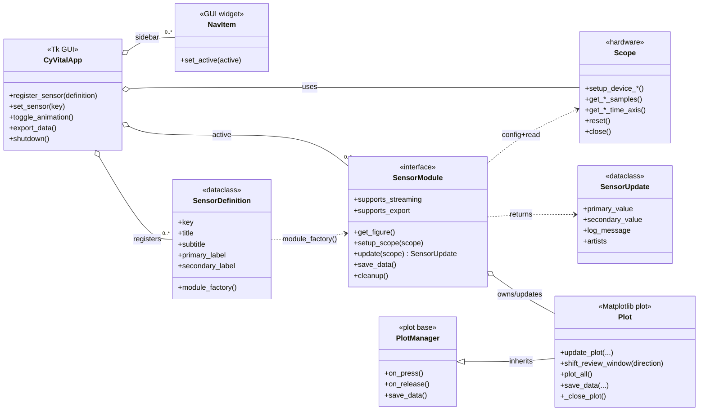

```mermaid
classDiagram
direction LR

%% =========================
%% High-level architecture
%% =========================

class CyVitalApp {
  <<Tk GUI>>
  +register_sensor(definition)
  +set_sensor(key)
  +toggle_animation()
  +export_data()
  +shutdown()
}

class NavItem {
  <<GUI widget>>
  +set_active(active)
}

class SensorDefinition {
  <<dataclass>>
  +key
  +title
  +subtitle
  +primary_label
  +secondary_label
  +module_factory()
}

class SensorUpdate {
  <<dataclass>>
  +primary_value
  +secondary_value
  +log_message
  +artists
}

class SensorModule {
  <<interface>>
  +supports_streaming
  +supports_export
  +get_figure()
  +setup_scope(scope)
  +update(scope) SensorUpdate
  +save_data()
  +cleanup()
}

class Scope {
  <<hardware>>
  +setup_device_*()
  +get_*_samples()
  +get_*_time_axis()
  +reset()
  +close()
}

class PlotManager {
  <<plot base>>
  +on_press()
  +on_release()
  +save_data()
}

class Plot {
  <<Matplotlib plot>>
  +update_plot(...)
  +shift_review_window(direction)
  +plot_all()
  +save_data(...)
  +_close_plot()
}

%% =========================
%% Relationships
%% =========================

CyVitalApp o-- Scope : uses
CyVitalApp o-- "0..*" NavItem : sidebar
CyVitalApp o-- "0..*" SensorDefinition : registers
CyVitalApp o-- "0..1" SensorModule : active

SensorModule ..> Scope : config+read
SensorModule ..> SensorUpdate : returns
SensorModule o-- Plot : owns/updates

PlotManager <|-- Plot : inherits

%% Optional: show that definitions create modules
SensorDefinition ..> SensorModule : module_factory()
```
