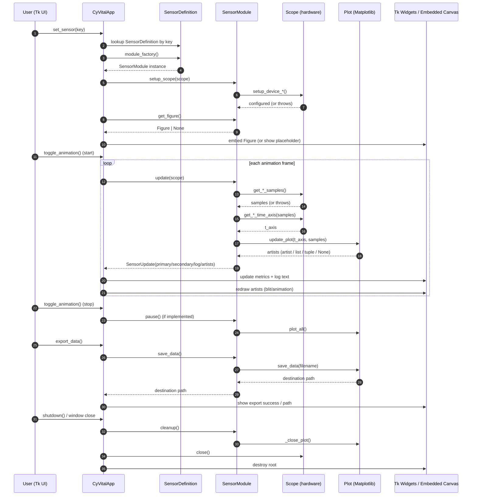

```mermaid
sequenceDiagram
autonumber
participant User as User (Tk UI)
participant App as CyVitalApp
participant Def as SensorDefinition
participant Mod as SensorModule
participant Scope as Scope (hardware)
participant Plot as Plot (Matplotlib)
participant UI as Tk Widgets / Embedded Canvas

%% --- Sensor selection ---
User->>App: set_sensor(key)
App->>Def: lookup SensorDefinition by key
App->>Def: module_factory()
Def-->>App: SensorModule instance
App->>Mod: setup_scope(scope)
Mod->>Scope: setup_device_*()
Scope-->>Mod: configured (or throws)
App->>Mod: get_figure()
Mod-->>App: Figure | None
App->>UI: embed Figure (or show placeholder)

%% --- Start streaming ---
User->>App: toggle_animation() (start)
loop each animation frame
  App->>Mod: update(scope)
  Mod->>Scope: get_*_samples()
  Scope-->>Mod: samples (or throws)
  Mod->>Scope: get_*_time_axis(samples)
  Scope-->>Mod: t_axis
  Mod->>Plot: update_plot(t_axis, samples)
  Plot-->>Mod: artists (artist / list / tuple / None)
  Mod-->>App: SensorUpdate(primary/secondary/log/artists)
  App->>UI: update metrics + log text
  App->>UI: redraw artists (blit/animation)
end

%% --- Pause streaming ---
User->>App: toggle_animation() (stop)
App->>Mod: pause() (if implemented)
Mod->>Plot: plot_all()

%% --- Export ---
User->>App: export_data()
App->>Mod: save_data()
Mod->>Plot: save_data(filename)
Plot-->>Mod: destination path
Mod-->>App: destination path
App->>UI: show export success / path

%% --- Shutdown ---
User->>App: shutdown() / window close
App->>Mod: cleanup()
Mod->>Plot: _close_plot()
App->>Scope: close()
App->>UI: destroy root
```
